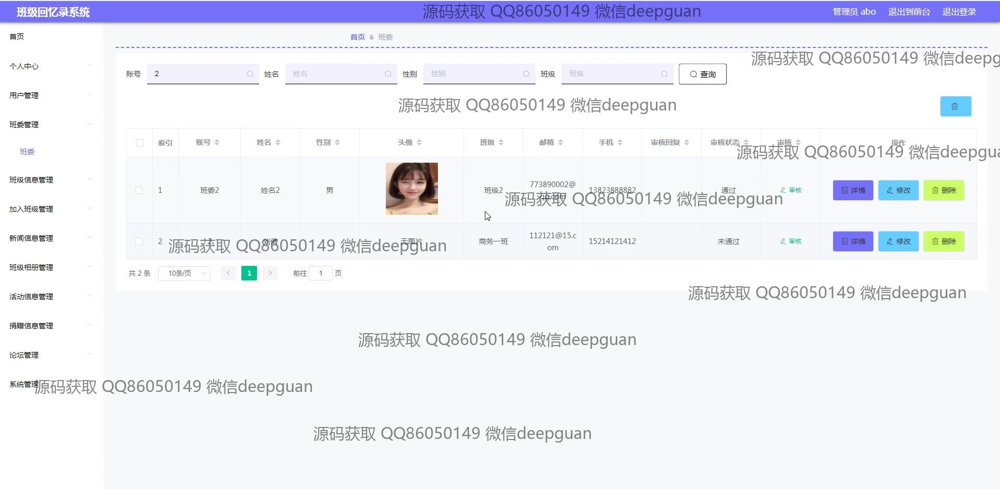
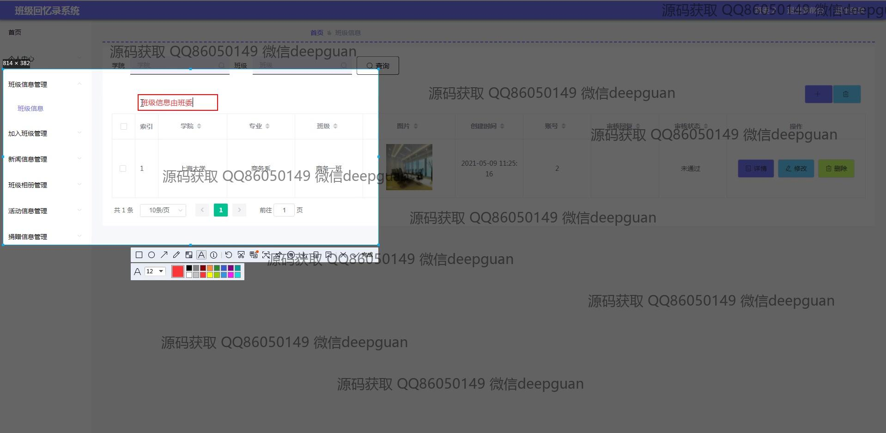
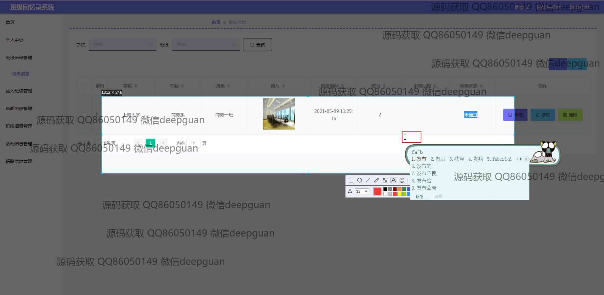
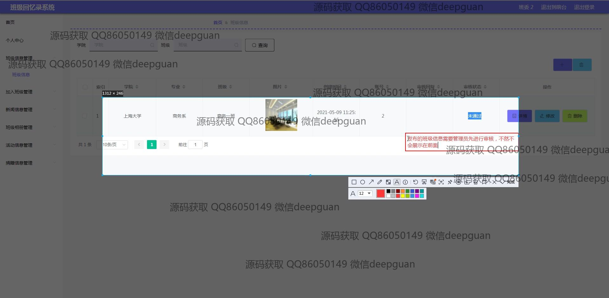
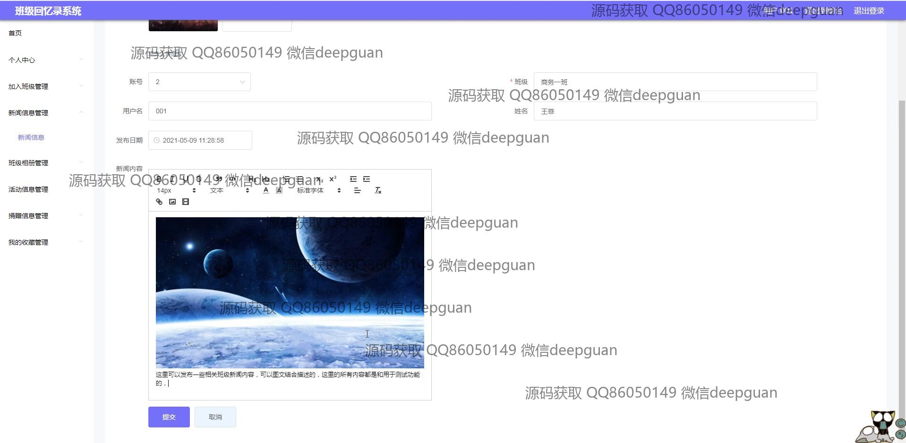
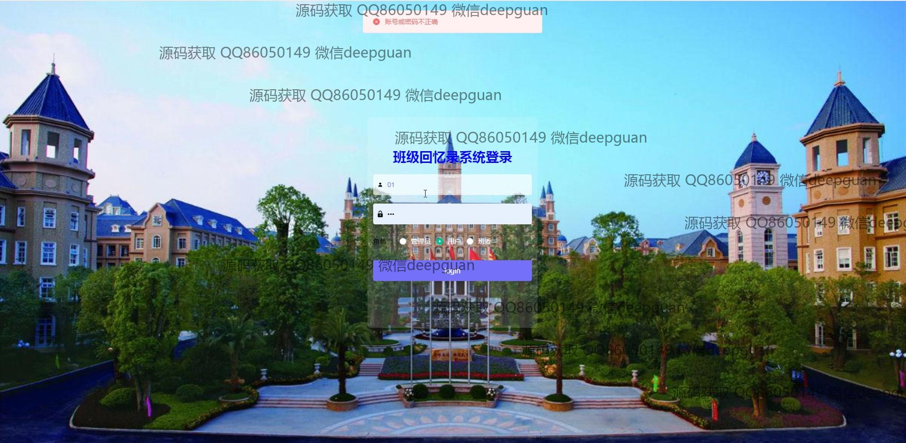
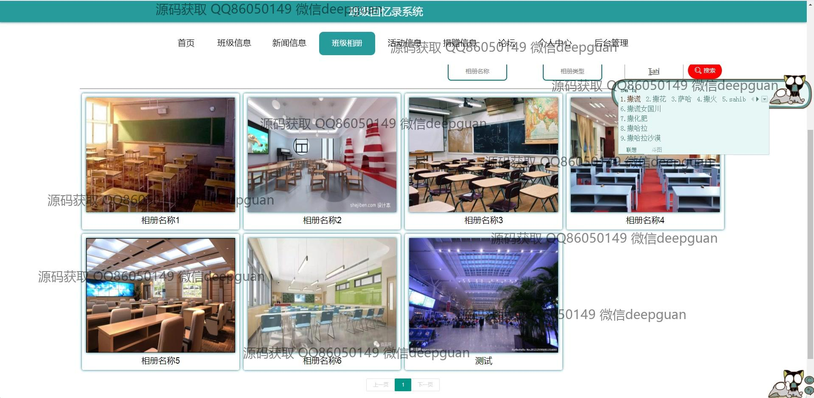

<h1 align="center">海滨学院班级回忆录的设计与实现</h1>

## 简介
海滨学院班级回忆录系统：用户可以通过多功能模块进行班级信息管理、新闻发布、活动记录、相册和捐赠信息管理，支持富文本编辑与图片上传，实现便捷的班级回忆与互动分享。    --计算机毕业设计源码；毕设源码；java毕业设计源码

## 联系方式

<h3 align="center">获取完整代码与数据库文件 + 微信：deepguan QQ: 86050149 QQ群: 783742310</h3>

<h3 align="center">可帮忙远程部署 包运行成功！提供远程部署、修改代码、设计文档指导、代码讲解等服务！</h3>

## 功能介绍（完整见运行截图）
管理员：管理员可以通过系统界面进行登录、注册和退出操作。系统首页提供导航栏，助力快速访问不同功能模块，包括班级信息管理、新闻及活动管理等。管理员可以管理班级信息，包括创建和编辑班级详情及图片上传，还能审核新闻和活动信息。系统允许管理员处理用户管理和配置权限。

用户：用户可以注册和登录系统，并访问个人中心查看和编辑个人信息。用户具备上传和管理班级图片、参与新闻发布和评论的权限。用户可通过导航菜单快速进入班级相册、活动信息、和新闻信息模块进行浏览和交互。在班级回忆录系统中，用户可以发布班级相关新闻，编辑和更新班级回忆内容。

## 运行截图

本代码来源于网络,仅供学习参考使用!

